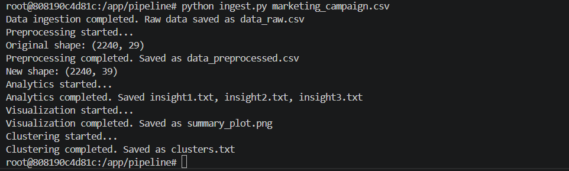
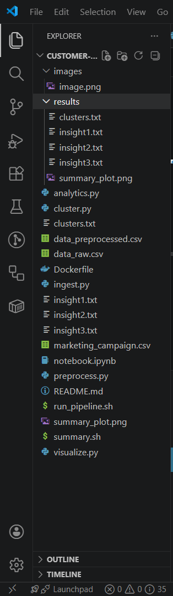
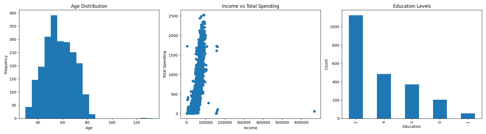
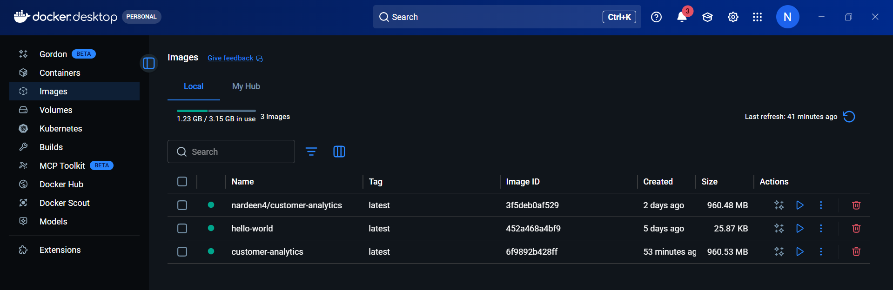

# Customer Analytics Data Pipeline

Assignment #1

---

1. Kerollos Emad
2. Nardeen Raafat

---

# Project Overview

This project implements a customer analytics pipeline inside Docker.  
The pipeline starts from a raw dataset, performs preprocessing, generates analytics insights, creates visualizations, applies K-Means clustering, and saves the final outputs in the `results/` folder.

The pipeline is reproducible inside Docker from start to finish.

The pipeline performs the following steps:

1. Data ingestion
2. Data preprocessing
3. Analytics
4. Data visualization
5. Clustering
6. Exporting results to host machine

---

# Project Structure

customer-analytics/
│
├── Dockerfile
├── ingest.py
├── preprocess.py
├── analytics.py
├── visualize.py
├── cluster.py
├── summary.sh
├── README.md
│
└── results/

---

# Docker Build Command

### Build Docker image

```bash
docker build -t customer-analytics .
```

# Run the Docker container

```bash
docker run -it --name customer-container customer-analytics bash

```

# Pipeline Execution Commands

```bash
#Run the pipeline starting from ingest:
python ingest.py dataset.csv
#python ingest.py marketing_campaign.csv


#run summary script:
bash summary.sh

#This copies results to (on the host machine):
customer-analytics/results/
```

# Execution Flow

ingest.py
↓
preprocess.py
↓
analytics.py
↓
visualize.py
↓
cluster.py

# Output Files

data_raw.csv
data_preprocessed.csv

insight1.txt
insight2.txt
insight3.txt

summary_plot.png

clusters.txt

All outputs are saved into:
results/

# screenshots









## Script Descriptions

### `ingest.py`

Reads the dataset path from the command line, loads the dataset, and saves a raw copy as `data_raw.csv`.

### `preprocess.py`

Performs data cleaning, feature transformation, dimensionality reduction, and discretization, then saves the processed data as `data_preprocessed.csv`.

### `analytics.py`

Generates textual insights and saves them into separate text files.

### `visualize.py`

Creates visualizations and saves them as `summary_plot.png`.

### `cluster.py`

Applies K-Means clustering and saves the number of samples per cluster into `clusters.txt`.

### `summary.sh`

Copies all generated output files into the `results/` folder and handles container cleanup.

# github:

https://github.com/NardeenRaafat444/customer-analytics
